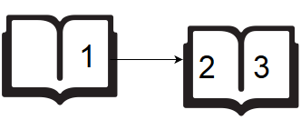

# Drawing Book

> A teacher asks the class to open their books to a page number. A student can either start turning pages from the front of the book or from the back of the book. They always turn pages one at a time. When they open the book, page 1 is always on the right hand side: 

> When they flip page **1**, they see pages **2** and **3**. Each page except the last page will always be printed on both sides. The last page may only be printed on the front, given the length of the book. If the book is **n** pages long, and a student wants to turn to page , what is the minimum number of pages to turn? They can start at the beginning or the end of the book.  Given **n** and **p**, find and print the minimum number of pages that must be turned in order to arrive at page **p**.

## **Example**

**n = 5**

**p = 3**

Using the diagram above, if the student wants to get to page **3**, they open the book to page **1**, flip **1** page and they are on the correct page. If they open the book to the last page, page **5**, they turn **1** page and are at the correct page. Return **1**.

### **Function Description**

Complete the pageCount function in the editor below.
pageCount has the following parameter(s):
- int n: the number of pages in the book
- int p: the page number to turn to

#### **Returns**
- int: the minimum number of pages to turn

#### **Constraints**

- 1 <= n <= 100^5
- 1 <= p <= n

#### **Sample Input 0**

> 6  2

#### **Sample Output 0**

> 1

#### **Explanation 0**

If the student starts turning from page **1**, they only need to turn **1** page:

If a student starts turning from page **6**, they need to turn **2** pages:

Return the minimum value, **1**.

#### **Sample Input 1**

> 5  4

#### **Sample Output 1**

> 0

#### **Explanation 1**

If the student starts turning from page **1**, they only need to turn **2** page:

If a student starts turning from page **5**, they do not need to turn any pages:

Return the minimum value, **0**.
