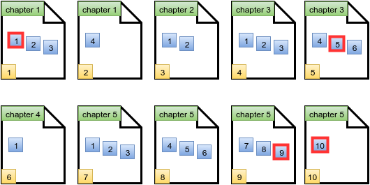

# Lisa's Workbook

> Lisa just got a new math workbook. A workbook contains exercise problems, grouped into chapters. Lisa believes a problem to be special if its index (within a chapter) is the same as the page number where it's located. The format of Lisa's book is as follows:

- There are *n* chapters in Lisa's workbook, numbered from **1** to **n**.
- The *ith* chapter has **arr[i]**  problems, numbered from **1** to **arr[i]**.
- Each page can hold up to **k** problems. Only a chapter's last page of 
  exercises may contain fewer than *k* problems.
- Each new chapter starts on a new page, so a page will never contain problems from more than one chapter.
- The page number indexing starts at **1**.

Given the details for Lisa's workbook, can you count its number of special problems?

## **Example**

**arr = [4,2]**
**k = 3**

Lisa's workbook contains **arr[1] = 4**  problems for chapter **1**, and **arr[2] = 2** problems for chapter **2**. Each page can hold **k = 3** problems.

The first page will hold **3** problems for chapter **1**. Problem **1** is on page **1**, so it is special. Page **2** contains only Chapter **1**, Problem **4**, so no special problem is on page **2**. Chapter **2** problems start on page **3** and there are **2** problems. Since there is no problem **3** on page **3**, there is no special problem on that page either. There is **1** special problem in her workbook.

> Note: See the diagram in the Explanation section for more details.

### **Function Description**

Complete the `workbook` function in the editor below.

workbook has the following parameter(s):

- int n: the number of chapters
- int k: the maximum number of problems per page
- int arr[n]: the number of problems in each chapter

#### **Returns**
- int: the number of special problems in the workbook

#### **Input Format**
The first line contains two integers **n** and **k**, the number of chapters and the maximum number of problems per page.
The second line contains **n** space-separated integers **arr[i]** where **arr[i]** denotes the number of problems in the *ith* chapter.

#### **Constraints**

> 1 <= n, k, arr[i] <= 100

#### **Sample Input 0**

> STDIN       Function -----       -------- 5 3         n = 5, k = 3 4 2 6 1 10  arr = [4, 2, 6, 1, 10]

#### **Sample Output 0**

> 4

#### **Explanation 0**

The diagram below depicts Lisa's workbook with **n = 5** chapters and a maximum of **k = 3** problems per page. Special problems are outlined in red, and page numbers are in yellow squares.

There are  special problems and thus we print the number *4* on a new line.
